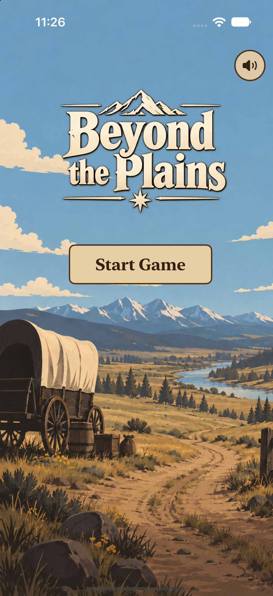
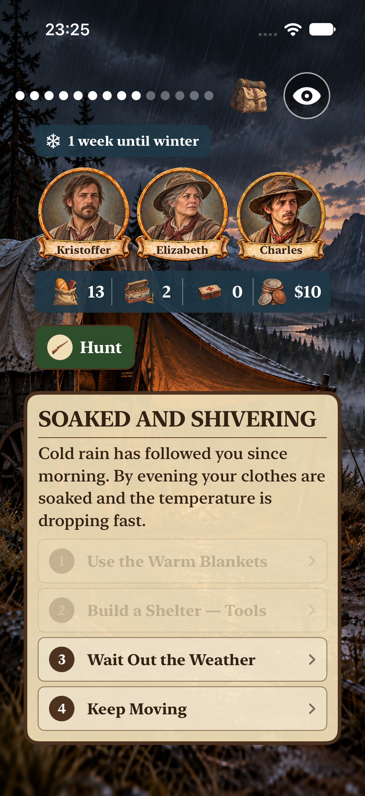
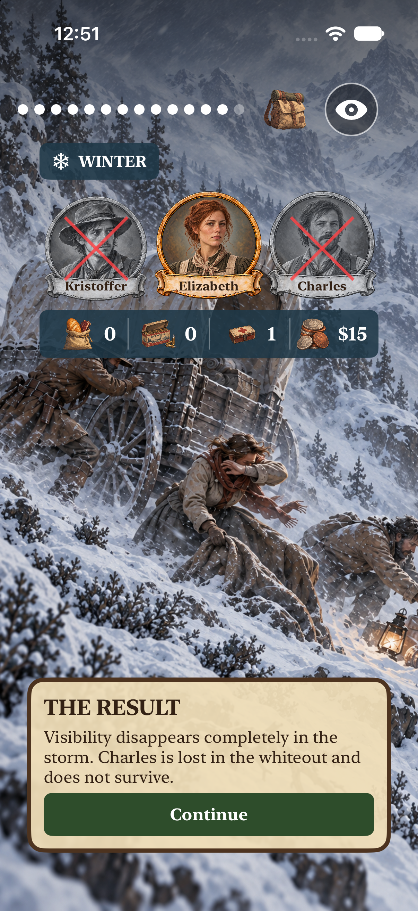
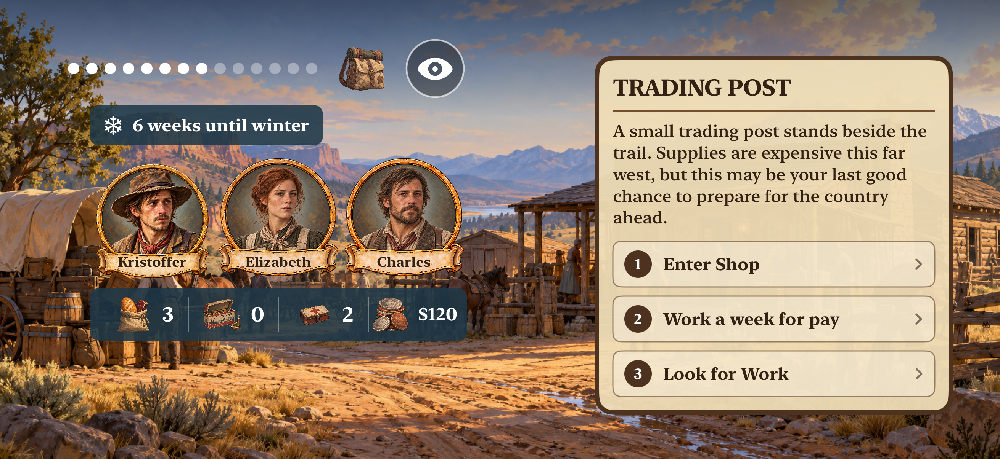
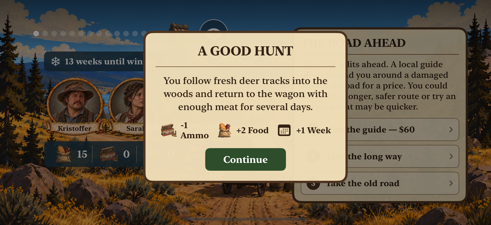
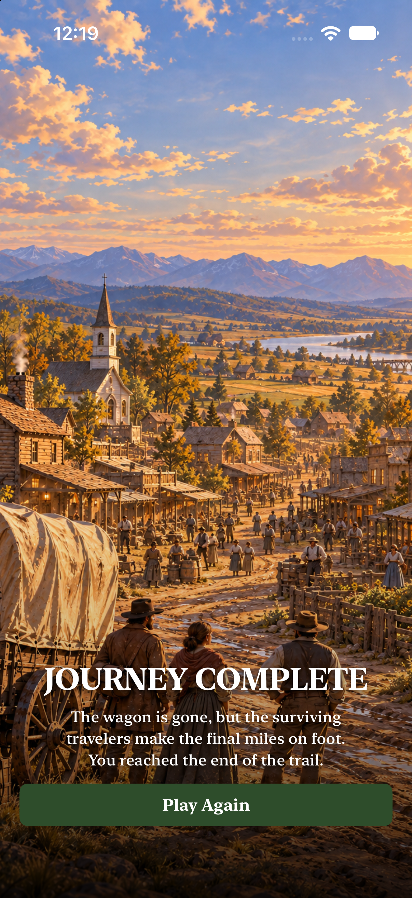

# Beyond the Plains

Beyond the Plains er et iOS-spill inspirert av klassikeren *The Oregon Trail*. Spilleren forbereder seg på en reise vestover gjennom USA på 1800-tallet, velger hvem som skal være med, kjøper forsyninger og tar valg som påvirker resten av reisen.

## Laget med

- Swift og SwiftUI
- Tilpasset grensesnitt for stående og liggende skjerm
- Styring av reisefølge og ressurser
- Valg som får konsekvenser senere i spillet
- Flere mulige avslutninger
- Grafikk, lyd og musikkoverganger

Dette er et hobby- og læringsprosjekt som er utviklet fra start til slutt som en komplett iOS-app.

## Demo

[▶ Se gameplay-videoen](Media/SmallDemo2BeyonThePlains.mov)

## Bilder

